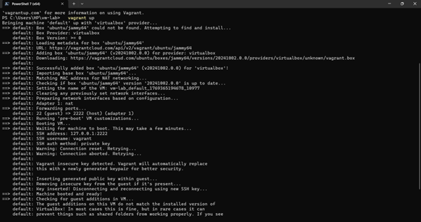
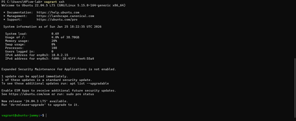
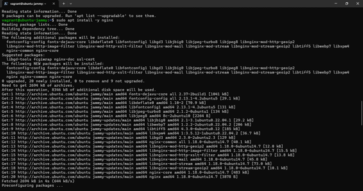
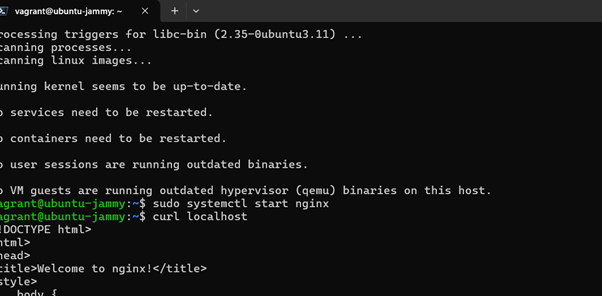
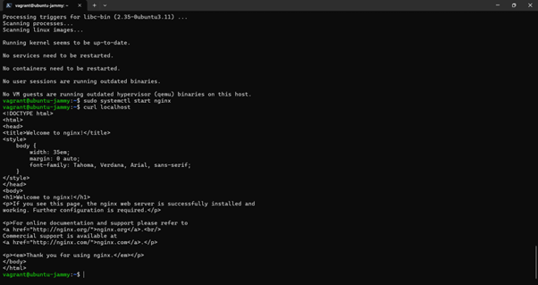

# Lab 1: Comparison of Virtual Machines (VMs) and Containers

---

## 1. Objective

The primary goals of this experiment are:

- To understand the conceptual and practical differences between Virtual Machines (VMs) and Containers.
- To install and configure an Ubuntu-based Nginx web server using both VirtualBox/Vagrant and Docker inside WSL.
- To compare resource utilization, performance, and operational characteristics of both environments.

---

## 2. Hardware and Software Requirements

### Hardware
- 64-bit system with virtualization enabled in BIOS
- Minimum 8 GB RAM (4 GB acceptable)
- Internet connection

### Software
- Oracle VirtualBox
- Vagrant
- Windows Subsystem for Linux (WSL 2) with Ubuntu
- Docker Engine (docker.io)

---

## 3. Theory

| Feature | Virtual Machine (VM) | Container |
|----------|----------------------|------------|
| Virtualization Level | Emulates complete hardware and kernel | Virtualizes at OS level, shares host kernel |
| Isolation | Strong (Full OS isolation) | Moderate (Process-level isolation) |
| Resource Usage | Higher (Dedicated RAM/CPU for OS) | Lightweight and efficient |
| Startup Time | Slower (Seconds/Minutes) | Fast (Milliseconds/Seconds) |

---

# 4. Experiment Setup – Part A: Virtual Machine

## Step 1: Initialization and Deployment

Using Vagrant, an Ubuntu VM was initialized and started.

```bash
vagrant init ubuntu/jammy64
vagrant up
```



**Observation:**  
The system downloads the Ubuntu Jammy base box and configures the VirtualBox provider. Port forwarding (2222 → 22) is established.

---

## Step 2: Accessing the VM (SSH)

```bash
vagrant ssh
```



**Observation:**  
Successful login to Ubuntu 22.04.5 LTS environment.

---

## Step 3: Installing Nginx

```bash
sudo apt update
sudo apt install -y nginx
```


**Observation:**  
The apt package manager installs required dependencies. This process is slower compared to Docker because a full OS environment is involved.



**Observation:**  
Installation completes successfully with triggers processed for man-db and ufw.

---

## Step 4: Verification Inside VM

```bash
curl localhost
```



**Observation:**  
The command returns the full HTML source of the “Welcome to nginx!” page.

---

# 5. Experiment Setup – Part B: Containers (Docker)

## Step 1: Running the Container

```bash
docker run -dp 8080:80 --name nginx-container nginx
```


**Observation:**  
Docker pulls image layers and starts the container almost instantly.

---

## Step 2: Verification

```bash
curl localhost:8080
```

.png)
.png)

**Observation:**  
The Nginx “Welcome” page is successfully displayed on port 8080.

---

# 6. Resource Utilization & Comparison

## A. Boot Time Analysis

```bash
systemd-analyze
```


**Observation (VM):**  
The VM took 36.819 seconds to finish startup (6.9s kernel + 29.8s userspace).

**Observation (Container):**  
The container started in less than 1 second.

---

## B. Process Overhead & Isolation

```bash
htop
```


**Observation (VM):**  
Multiple background services such as systemd, snapd, rsyslogd, polkitd, and sshd are running.

```bash
docker stats
```


**Observation (Container):**  
The container runs only the Nginx process and minimal dependencies.

---

## C. Memory Usage

```bash
free -h
```


**Observation (VM):**  
957 Mi total allocated, with ~196 Mi used by OS services.

**Observation (Container):**  
Container consumes approximately 13.22 MiB of RAM.

---

## Comparison Summary Table

| Parameter | Virtual Machine (VM) | Container (Docker) |
|------------|----------------------|---------------------|
| Boot Time | ~36.8 seconds | < 1 second |
| RAM Usage | ~196 MiB | ~13.22 MiB |
| Background Processes | High | Low |
| Disk Usage | Larger | Smaller |

---

# 7. Conclusion

This experiment demonstrates that Containers are significantly more lightweight than Virtual Machines.

- **Speed:** Docker containers start instantly, while VMs require ~37 seconds to boot.
- **Efficiency:** VMs consume ~200MB RAM for OS overhead, whereas containers use ~13MB.
- **Complexity:** VMs run a full operating system stack, creating additional overhead.

**Final Conclusion:**  
Containers are ideal for microservices and rapid scaling, while Virtual Machines are better suited for complete OS isolation and hardware-level simulation.
